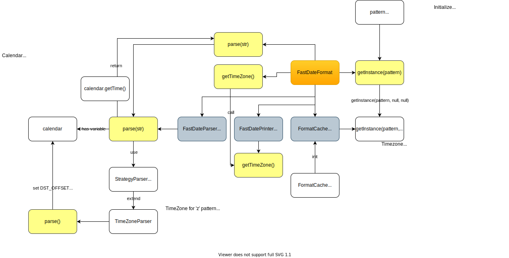

# Java Check

Practice repo to check Java logics and libraries.
## SimpleDateFormat vs FastDateFormat

```
FastDateFormat[yyyy/MM/dd HH:mm:ss z,ja_JP,Asia/Tokyo]
[FastDateFormat] getTimeZone:Asia/Tokyo
[DateFormat] getTimeZone:UTC
[FastDateFormat] parsed.getTimezoneOffset:Sat Jul 10 19:23:44 JST 2021
[DateFormat] parsed.getTimezoneOffset:Sat Jul 10 19:23:44 JST 2021
FastDateFormat[yyyy/MM/dd HH:mm:ss z,ja_JP,Asia/Tokyo]
[FastDateFormat] getTimeZone:Asia/Tokyo
[DateFormat] getTimeZone:America/Los_Angeles
[FastDateFormat] parsed.getTimezoneOffset:Sun Jul 11 02:23:44 JST 2021
[DateFormat] parsed.getTimezoneOffset:Sun Jul 11 02:23:44 JST 2021
```


